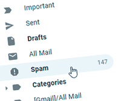

# Tempmailo Docs

Email for One Time - Tempmailo is a **fast**, **simple** and **downright gorgeous** temp mail service.

---

## Overview

I'm pretty sure everyone has had a similar situation. You've come to a website that offers a great free e-book. And you need to create an account there.

*Secure from spam - just use [temporary email account](https://tempmailin.com/).*

Yet you know that these deals are often not as big as they were advertised. Your email account doesn't want to be included. You don't want to tackle spam or think about the number of emails that will start coming.

## Solution

Here's a quick and easy option: create a temporary free email address for confirmation only! 

Often known as a disposable email address, backup email, throwaway email or one-time email. This account will only function as a one-day email, 10 minutes email or 1-hour mail. Or for any time you have picked. You will stay anonymous entirely and your email will no longer receive any spam.

**Get a new temp mail whenever you need it.**

## What is TempMailIn

[Tempmailin](https://tempmailin.com/ "Tempmailin") is website providing service for temp mail or also called 10 minute mail or disposable email.

The purpose of this website is helping people information security, without unnecessary, spam or fraud.